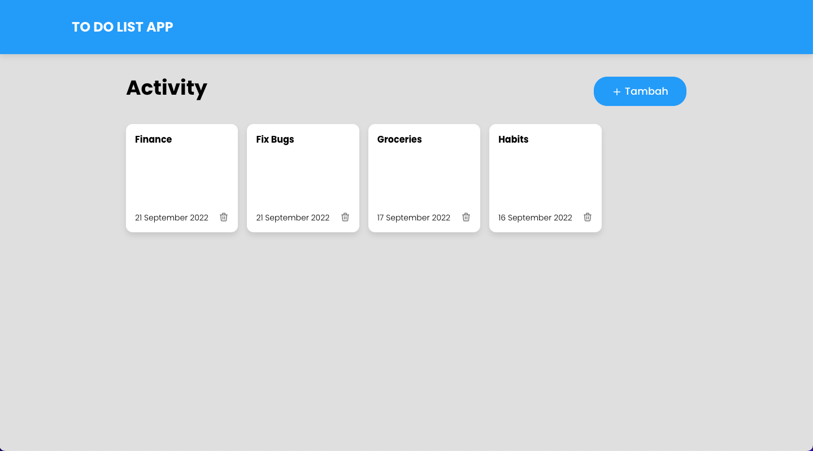
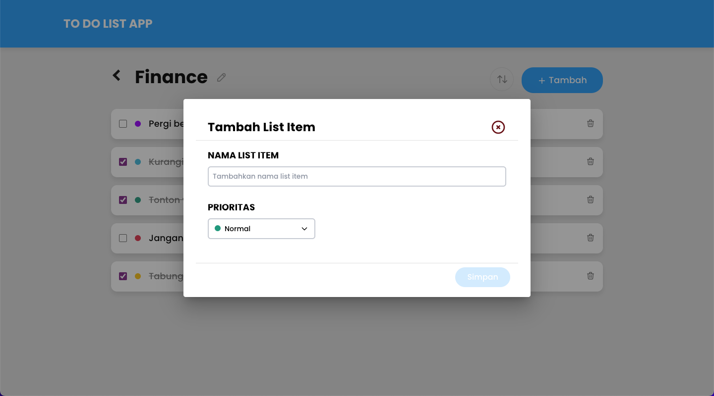

# Devcode To-do List App

A to-do list web app that created when i joined [Devcode Frontend Challenge](https://devcode.gethired.id/challenge/vuejs-todolist) by [Gethired.id](https://gethired.id/) few days ago. The app contains some basic features like adding, updating, and removing todos. Todos are grouped inside an activity.

Here's some preview of the app.

## Technologies

- [Vue.js](https://v2.vuejs.org/)
- [Vuex](https://vuex.vuejs.org/)
- [Vue-router](https://router.vuejs.org/introduction.html)
- [Vuetify](https://vuetifyjs.com/en/getting-started/installation/)
- [TailwindCSS](https://tailwindcss.com/)
- [Axios](https://axios-http.com/docs/intro)

## Project setup

- Clone this repository
- Run npm install
- Change userEmail value on index.js at store folder
- Run npm run serve

## Maintainer

- [Bagas](https://github.com/wahudamon)

## License

(c) 2022 Afwa Bagas Wahuda, under MIT License.
